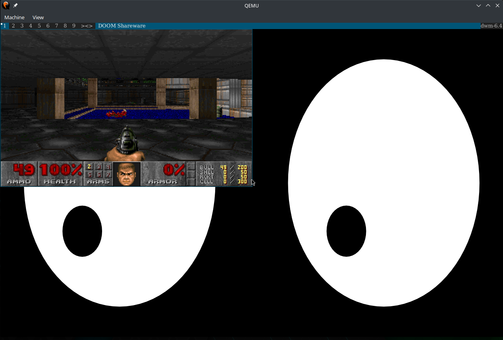

<p align="center">
    
</p>

# Aero

**Aero** is a new modern, experimental, unix-like operating system written in Rust. 
Aero follows the monolithic kernel design and it is inspired by the Linux Kernel. 
Aero supports *modern* PC features such as Long Mode, 5-level paging, 
and SMP (multicore), to name a few.


[](https://github.com/Andy-Python-Programmer/aero)
[](https://discord.gg/8gwhTTZwt8)

**Is this a Linux distribution?**
No, Aero runs its own kernel that does *not* originate from Linux and does not share any source code or binaries with the Linux kernel.

**Official Discord Server**: <https://discord.gg/8gwhTTZwt8>

# Screenshots

<p align="center">Running <a href="https://dwm.suckless.org/">DWM</a>, <a href="https://github.com/freedesktop/xorg-xeyes">Xeyes</a> and DOOM in Aero!</p>

# Features
- 64-bit higher half kernel
- 4/5 level paging
- Preemptive per-cpu scheduler
- Modern UEFI bootloader
- ACPI support (ioapic, lapic)
- Symmetric Multiprocessing (SMP)
- On-demand paging

# Goals

* Creating a modern, safe, beautiful and fast operating system.
* Targetting modern 64-bit architectures and CPU features.
* Good source-level compatibility with Linux so we can port programs over easily.
* Making a usable OS which can run on real hardware, not just on emulators or virtual machines.

# How to Build and Run Aero

Please make sure you have a **unix-like** host system before building 
Aero. If you are using windows, its highly recommended to use WSL 2.

## Dependencies

Before building Aero, you need the following things installed:
- `rust` (should be the **latest nightly**)
- `nasm`
- `qemu` (optional: required if you want to run it in the Qemu emulator)

If you are building Aero with sysroot, run the following helper script to install additional dependencies.
```sh
# make sure to run the script with root privileges!
./tools/deps.sh
```
You can optionally set the environment variable `VERBOSE` to `true`, which will pass through the output of your package manager for troubleshooting.
```sh
VERBOSE=true ./tools/deps.sh
```

Note: If your host operating system is not in the list below, you will need to determine the dependency packages' names for your package manager (contributions to this tool are welcome!)
- Arch Linux/based (pacman)
- Debian Linux/based (apt)
- macOS (homebrew)


## Hardware

The following are *not* requirements but are *recommendations*:
- ~15GB of free disk space
- \>= 8GB RAM
- \>= 2 cores
- Internet access

Beefier machines will lead to much faster builds!

## Getting the source code

The very first step to work on Aero is to clone the repository:
```shell
$ git clone https://github.com/Andy-Python-Programmer/aero
$ cd aero
```

## Building Aero

Aero uses a custom build system, that wraps `cargo` and takes care of building the kernel and
userland for you. It also builds the initramfs and disk image for you.

The main command we will focus on is `./aero.py`. The source code can be found in the
root of the repository and, as the file name states, it is written in Python.

By default if you run `./aero.py` without any arguments it will build the kernel and userland
in release mode with debug symbols and run it in QEMU. You can configure the behavior of the 
build system though. If you want to, you can use the `--help` option to read a brief description 
of what it can do.

The build system acknowledges few different build modes, which cannot be used together
and they are: `--clean`, `--check`, `--test` and `--document`.

- `--clean` option will clean all the build outputs.
- `--check` will build the kernel and userland using cargo's `check` command,
  this build mode will not produce a disk image, if you want one without actually
  running Aero in the emulator read ahead
- `--test` will run the built-in Aero test suite
- `--document` will generate web-based docs using cargo's `doc` command
- `--sysroot` will build the full userland sysroot. If not passed, then the sysroot will only contain 
the `aero_shell` and the `init` binaries. 

  **Note**: This command will require a relatively large amount of storage 
space. You may want to have upwards of 10 or 15 gigabytes available if building with full sysroot.

Each of these modes can be used with additional flags, that will alter the behavior in different
ways, some of them will not work for some of these modes - for example: the `--la57` option
will not have any effect when you are simply checking or documenting the build.

- `--debug` toggles off the release build flag when calling cargo.

  **Summary**: If the `--debug` flag is not passed then it will build Aero in release mode
               and debug symbols will be avaliable. On the other hand, if the debug flag is passed
               then it will be built in debug mode and debug symbols will be still avaliable. By default
               Aero is built in release mode (with debug symbols) since it generates faster and smaller
               binaries which are easier to test.
- `--no-run` prevents from running the built disk image in the emulator
- `--bios` lets you choose the firmware the emulator will use when booting Aero,
  currently supported values are: `legacy` and `uefi`
- `--features` accepts a single comma-separated list of kernel crate features, please
  keep in mind that there cannot be spaces in between the values
- `--target` lets you override the target architecture for which the kernel is built,
  currently the default value is `x86_64-aero_os`
- `--la57` tells the emulator to use 5 level paging, if it supports it

The built disk image is stored in the `build` directory under the name `aero.iso`. Both the
disk root and initramfs root are preserved in case you want to inspect them manually.

## Running Aero in an emulator

If you haven't used the `--no-run` option and you aren't using the `--check` or `--document` build
mode, the build system will run Aero in the emulator for you.

## Nightly Images

Want to give Aero a shot, without building it! You can go to the [latest job](https://github.com/Andy-Python-Programmer/aero/actions/workflows/build.yml?query=is%3Asuccess+branch%3Amaster) and download the latest nightly image (`aero.iso`), under artifacts.

# Contributing

Contributions are absolutely, positively welcome and encouraged! Check out [CONTRIBUTING.md](CONTRIBUTING.md) for the contributing guidelines for aero.

# License

Aero is free software: you can redistribute it and/or modify
it under the terms of the GNU General Public License as published by
the Free Software Foundation, either version 3 of the License, or
(at your option) any later version. See the [LICENSE](LICENSE) file for license rights and limitations.
