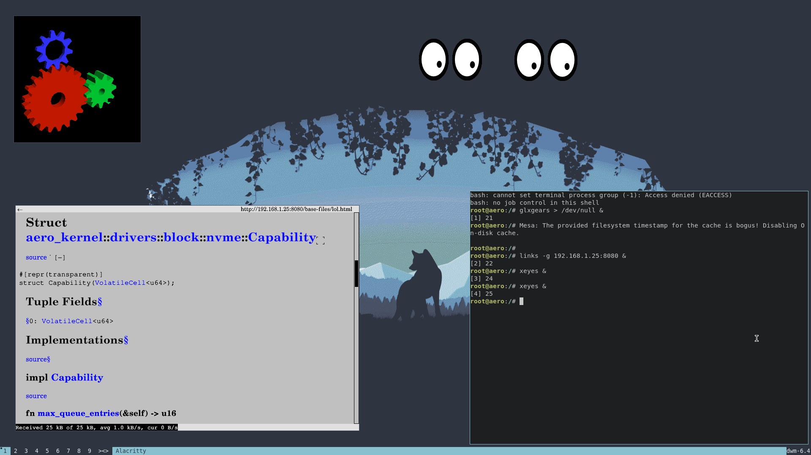

<p align="center">
    
</p>

# Aero

**Aero** is a new modern, experimental, unix-like operating system written in Rust. 
Aero follows the monolithic kernel design and it is inspired by the Linux Kernel. 
Aero supports *modern* PC features such as Long Mode, 5-level paging, 
and SMP (multicore), to name a few.


[](https://github.com/Andy-Python-Programmer/aero)
[](https://discord.gg/8gwhTTZwt8)

**Is this a Linux distribution?**
No, Aero runs its own kernel that does *not* originate from Linux and does not share any source code or binaries with the Linux kernel.

**Official Discord Server**: <https://discord.gg/8gwhTTZwt8>

# Screenshots

<p align="center">Running <a href="https://dwm.suckless.org/">DWM</a>, <a href="https://github.com/freedesktop/mesa-demos">mesa-demos</a> and <a href="https://github.com/alacritty/alacritty">Alacritty</a> in Aero!</p>

# Features
- 64-bit higher half kernel
- 4/5 level paging
- Preemptive per-cpu scheduler
- Modern UEFI bootloader
- ACPI support (ioapic, lapic)
- Symmetric Multiprocessing (SMP)
- On-demand paging

# Goals

* Creating a modern, safe, beautiful and fast operating system.
* Targeting modern 64-bit architectures and CPU features.
* Good source-level compatibility with Linux so we can port programs over easily.
* Making a usable OS which can run on real hardware, not just on emulators or virtual machines.

# How to Build and Run Aero

Please make sure you have a Linux host system before building 
Aero. If you are using windows, use WSL 2.

## Dependencies

Before building Aero, you need the following things installed:
- `rust` (should be the **latest nightly**)
- `nasm`
- `qemu` (optional: required if you want to run it in the Qemu emulator)
- `make`

## Hardware

The following are *not* requirements but are *recommendations*:
- ~15GB of free disk space (this will vary depending on the amount of packages you want to build)
- \>= 8GB RAM
- \>= 2 cores
- Internet access

Beefier machines will lead to much faster builds!

## Getting the source code

The very first step to work on Aero is to clone the repository:
```shell
$ git clone https://github.com/Andy-Python-Programmer/aero
$ cd aero
```

## Building Aero

```shell
make distro-image
make qemu

# To build documentation run the following command. The documentation will be outputed to the `target/doc` directory.
make doc
# The documentation will be available in the `target/doc` directory.
```

# Contributing

Contributions are absolutely, positively welcome and encouraged! Check out [CONTRIBUTING.md](CONTRIBUTING.md) for the contributing guidelines for aero.

# License


Aero is free software: you can redistribute it and/or modify
it under the terms of the GNU General Public License as published by
the Free Software Foundation, either version 3 of the License, or
(at your option) any later version. See the [LICENSE](LICENSE) file for license rights and limitations.
