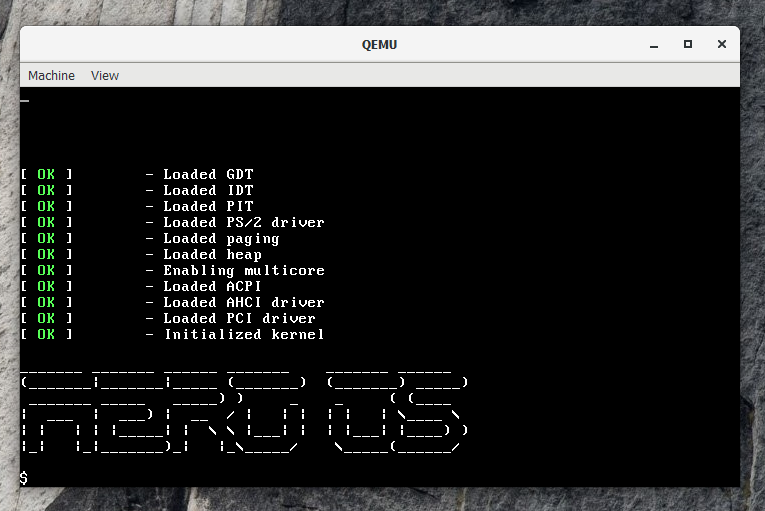

# Areo

**Aero** is a new modern, unix based operating system written in Rust and is being developed for educational purposes. Aero follows the monolithic kernel design and it is inspired by the Linux Kernel and the Zircon Kernel.

Please make sure you use the **latest nightly** of rustc before building Aero.


[](https://github.com/Andy-Python-Programmer/aero)

## Screenshots


## Roadmap March - April 2021

- [x] Global Descriptor Table
- [x] Interrupt Descriptor Table
- [x] Programmable Interval Timer
- [ ] Paging

## Building Aero

### Prerequisites
- The nightly [rust compiler](https://www.rust-lang.org/).
- Any release of [qemu](https://www.qemu.org/) (using the latest release is recommended).

### Build
To build and run aero:

```sh
    $ cargo run
```

## Contributing
Contributions are absolutely, positively welcome and encouraged!